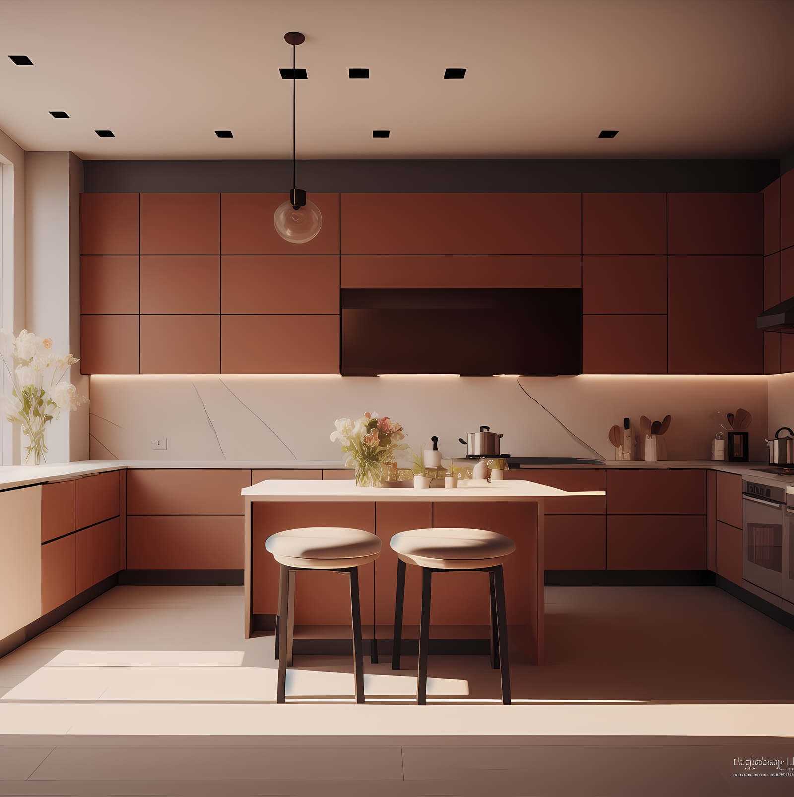
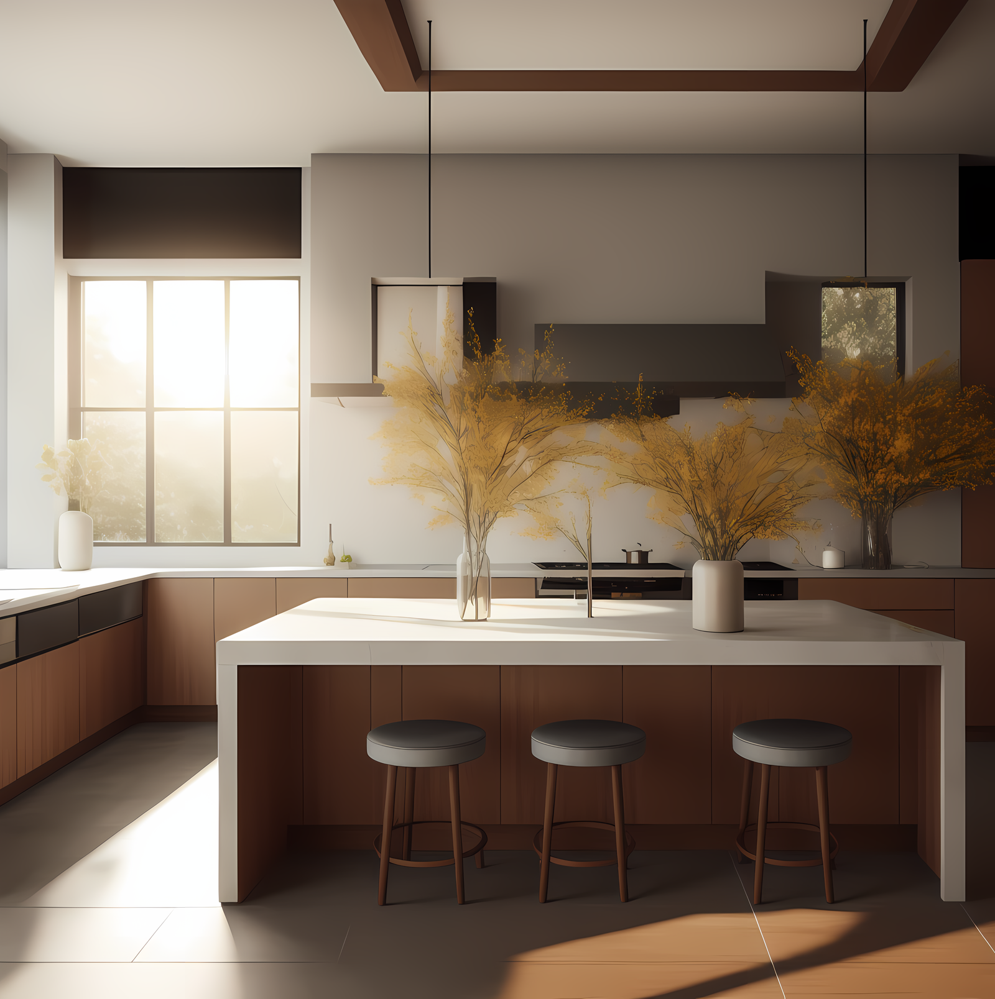
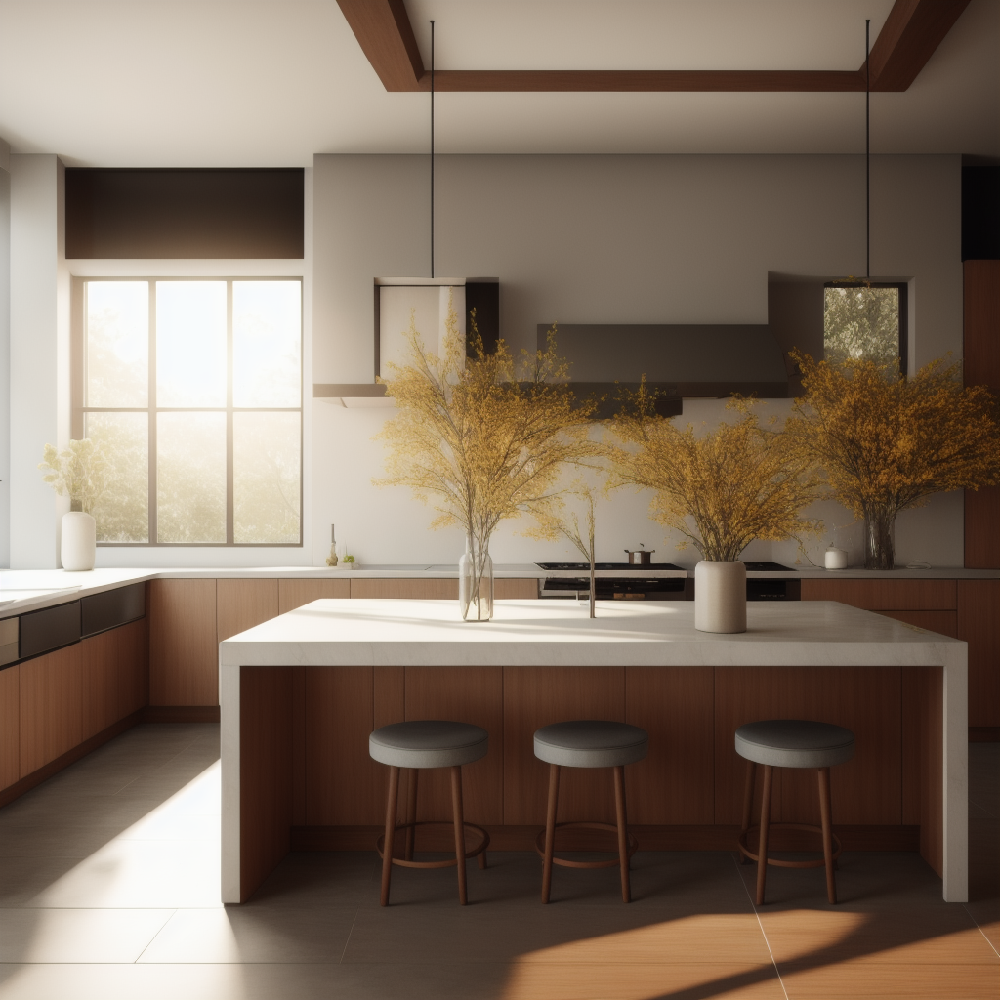
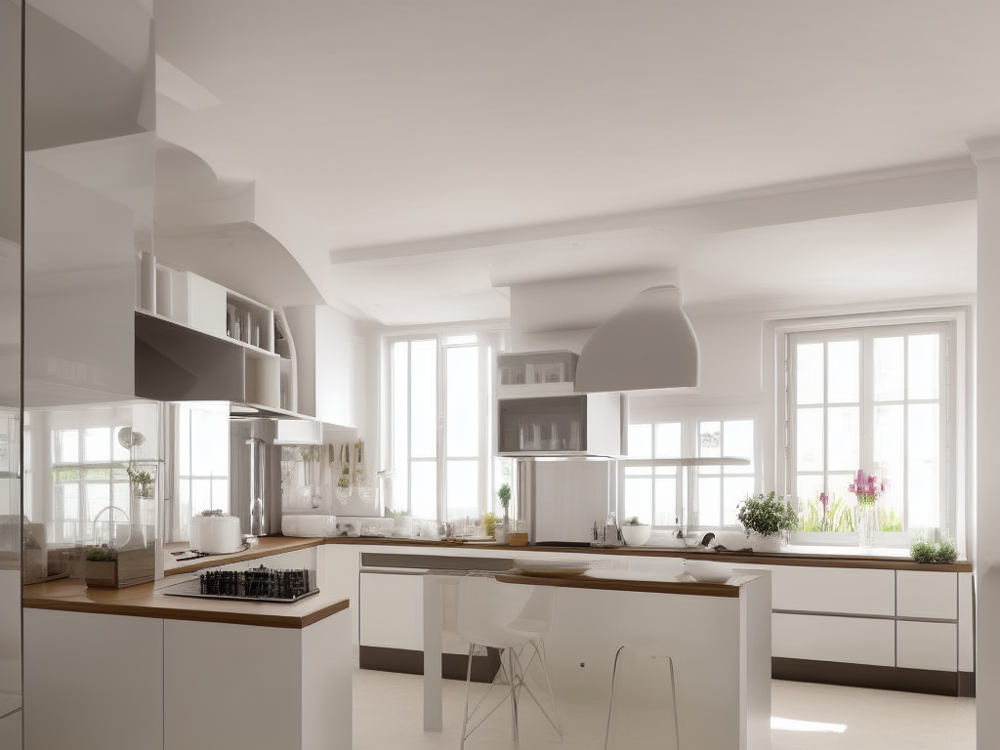
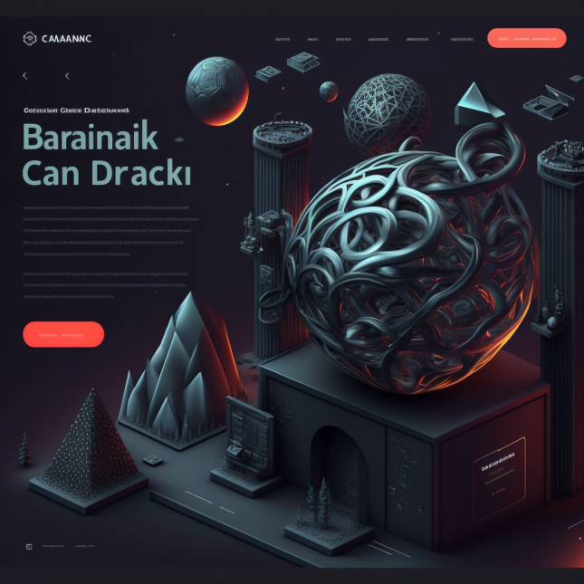
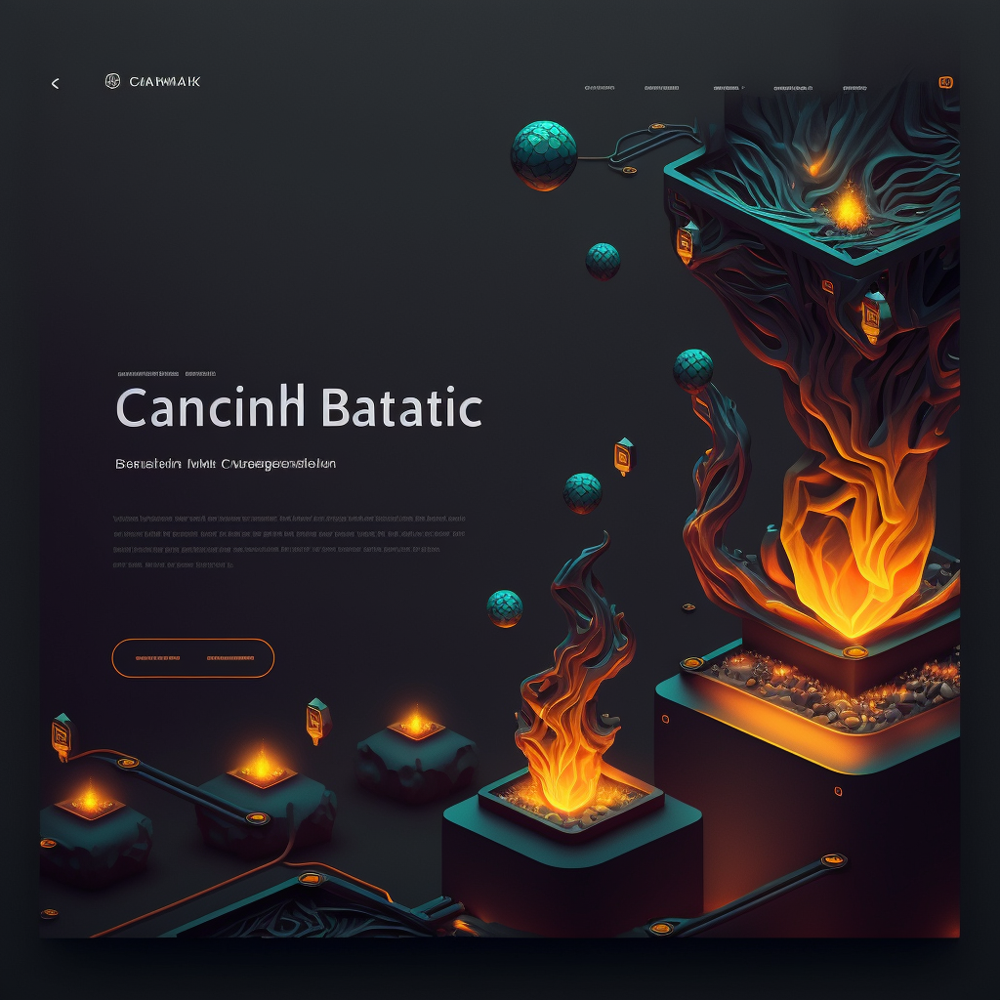

<!DOCTYPE html>
<html lang="en">
<head>
    <meta charset="UTF-8">
    <meta name="viewport" content="width=device-width, initial-scale=1.0">
    <title>R'eclat</title>
    <link href="https://fonts.googleapis.com/css?family=Roboto&display=swap" rel="stylesheet">
    <link href="https://fonts.googleapis.com/css?family=Roboto+Condensed&display=swap" rel="stylesheet">
    <link rel="stylesheet" type="text/css" href="style.css">
    
</head>
<body>

    

    <header id="home">
        <h1>R'eclat</h1>
        
Timeless Jewelry Creations

        <!-- 添加新的导航按钮 -->
        

             <!-- 使用你想要的菜单icon -->
        

        <!-- 添加新的导航按钮 -->
        

            
 <a href="#home">Home</a>

            
 <a href="#about">About</a>

            
 <a href="#vision">Vision</a>

            
 <a href="#mission">Mission</a>

            
 <a href="#collections">Collections</a>

            
 <a href="#custom-design">Custom Design</a>

            
 <a href="#digital-presence">Digital Presence</a>

            
 <a href="#contact">Contact</a>

        

    </header>

    <nav id="main-nav">
        <a href="#home">Home</a>
        <a href="#about">About</a>
        <a href="#vision">Vision</a>
        <a href="#mission">Mission</a>
        <a href="#collections">Collections</a>
        <a href="#custom-design">Custom Design</a>
        <a href="#digital-presence">Digital Presence</a>
        <a href="#contact">Contact</a>
    </nav>

    <main>
        <section id="about">
            <h2>Welcome to R'eclat</h2>
            
R'eclat, based in Singapore, specializes in crafting elegant, timeless, and high-quality jewelry pieces. Our passionate designers use both classic and modern techniques, creating unique masterpieces that capture the essence of beauty and sophistication.

            
From shimmering diamonds to vibrant gemstones, our thoughtfully curated collections cater to your individual style, ensuring that you find the perfect jewelry for every occasion. Explore our offerings and indulge in the artistry of R'eclat.

        </section>

        <section id="vision">
            <h2>Our Vision</h2>
            
To redefine luxury by weaving personal stories and unparalleled craftsmanship into every piece of jewelry.

        </section>

        <section id="mission">
            <h2>Our Mission</h2>
            
R’éclat is committed to curating a personal journey for each customer, transforming their visions and emotions into wearable art that stands the test of time.

        </section>

        <section id="collections">
            <h3>Featured Collection</h3>
            

                

                    
                    
Product 1

                

                

                    
                    
Product 2

                

                

                    
                    
Product 3

                

                

                    
                    
Product 4

                

                

                    
                    
Product 5

                

                

                    
                    
Product 6

                

                

                    
                    
Product 7

                

                

                    
                    
Product 8

                

                

                    
                    
Product 9

                

                

                    
                    
Product 10

                

            

        </section>

        <section id="custom-design">
            <h2>Custom Design Services</h2>
            

                
At R'eclat, we offer custom design services to create personalized jewelry pieces tailored to your unique style and taste. Our experienced artisans use their craftsmanship and expertise to bring your vision to life by selecting the finest materials and using innovative design techniques.

                
To take advantage of our custom design services and receive a one-of-a-kind piece of jewelry, follow these simple steps:

                <ol>
                    <li>Contact us to schedule a consultation with our designers.</li>
                    <li>Share your vision, preferences, and budget during the consultation.</li>
                    <li>Our designers will create a design sketch and provide a price quote for your approval.</li>
                    <li>Upon approval, we will create your custom piece using the highest quality materials and craftsmanship.</li>
                </ol>
                
Start your journey to exceptional style by creating a unique piece of jewelry that reflects your personality and showcases your individuality. For more information or to schedule a consultation, please <a href="#contact">contact us</a>.

            

        </section>

        <section id="digital-presence">
            <h2>Digital Presence</h2>
            
Recognizing the importance of digital connectivity in today’s world, R’éclat provides an online platform...

        </section>

        <section id="contact">
            <h2>Contact Us</h2>
            
If you have any questions or concerns, please feel free to reach out by filling out the form below:

            

                <form class="contact-form" action="#" method="POST">
                    <input type="text" name="name" placeholder="Your name" required>
                    <input type="email" name="email" placeholder="Your email" required>
                    <textarea name="message" rows="6" cols="40" placeholder="Your message" required></textarea>
                    <input type="submit" value="Send Message">
                </form>
            

            
Alternatively, you can also email us at: <a href="mailto:info@example.com">info@example.com</a>

        </section>
    </main>

    <footer>
        &copy; R'eclat, 2022. All Rights Reserved.
    </footer>
</body>
</html>
