<!DOCTYPE html>
<html lang="en">
<head>
    <meta charset="UTF-8">
    <meta name="viewport" content="width=device-width, initial-scale=1.0">
    <title>R'eclat</title>
    <link href="https://fonts.googleapis.com/css?family=Roboto&display=swap" rel="stylesheet">
    <link href="https://fonts.googleapis.com/css?family=Roboto+Condensed&display=swap" rel="stylesheet">
    <link rel="stylesheet" type="text/css" href="style.css">
    <link rel="stylesheet" href="https://cdnjs.cloudflare.com/ajax/libs/font-awesome/6.0.0-beta3/css/all.min.css" crossorigin="anonymous">
    
</head>
<body>

    

    <header id="home">
        <h1>R'eclat</h1>
        
Timeless Jewelry Creations

        <!-- 添加新的导航按钮 -->
        

            <i class="fa-solid fa-bars"></i>
        

        <!-- 添加新的导航按钮 -->
        

            
 <a href="#home">Home</a>

            
 <a href="#about">About</a>

            
 <a href="#vision">Vision</a>

            
 <a href="#mission">Mission</a>

            
 <a href="#collections">Collections</a>

            
 <a href="#custom-design">Custom Design</a>

            
 <a href="#digital-presence">Digital Presence</a>

            
 <a href="#contact">Contact</a>

        

    </header>

    <nav id="main-nav">
        <a href="#home">Home</a>
        <a href="#about">About</a>
        <a href="#vision">Vision</a>
        <a href="#mission">Mission</a>
        <a href="#collections">Collections</a>
        <a href="#custom-design">Custom Design</a>
        <a href="#digital-presence">Digital Presence</a>
        <a href="#contact">Contact</a>
    </nav>

    <main>
        <section id="about" class="container">
            <h2>Welcome to R'eclat</h2>
            
R'eclat, headquartered in the vibrant city of Singapore, is renowned for its exceptional craftsmanship in creating elegant, timeless, and high-quality jewelry pieces. Our dedicated team of skilled designers and artisans seamlessly blend traditional and contemporary techniques to forge distinctive masterpieces that embody the quintessence of beauty, luxury, and sophistication.

            
Our exquisite collections encompass a diverse array of precious materials, ranging from the alluring sparkle of carefully selected diamonds to the rich hues of ethically-sourced gemstones. We take immense pride in offering a wide variety of designs that cater to the unique tastes and preferences of our discerning clientele. At R'eclat, we believe that the perfect piece of jewelry has the power to elevate any occasion, be it a momentous celebration or an intimate expression of love.

            
As you embark on a journey through our carefully curated collections, prepare to be captivated by the unparalleled artistry and attention to detail that radiate from each R'eclat creation. With a relentless pursuit of excellence, we strive to exceed your expectations and deliver a truly personalized and luxurious experience that will leave you longing for more.

            
Discover the world of R'eclat, where the fusion of tradition and innovation culminates in an unforgettable symphony of elegance, refinement, and unparalleled craftsmanship.

        </section>

        <section id="vision" class="container">
            <h2>Our Vision</h2>
            
To redefine luxury by weaving personal stories and unparalleled craftsmanship into every piece of jewelry, R'eclat creates not just ornaments but timeless symbols of individuality and passion. Each design is an intricate tapestry of memories and dreams, meticulously crafted to capture the essence of the wearer's unique journey. Our master artisans blend age-old techniques with contemporary innovation, infusing every gemstone and metal with a soulful narrative. At R'eclat, luxury is more than opulence; it's a personal and intimate experience, where every shimmering piece tells a story, your story.

        </section>

        <section id="mission" class="container">
            

                <h2>Our Mission</h2>
                
R’éclat is dedicated to curating a uniquely personal journey for each customer, transforming their individual visions and deepest emotions into wearable art that not only stands the test of time but also resonates with their innermost self. Our approach intertwines the personal narratives and aspirations of our clients with the exemplary skill of our artisans, creating pieces that are not merely jewelry, but deeply meaningful expressions of one’s personal story and identity. In every curve, gemstone, and brush of metal, R’éclat captures the essence of moments and memories, crafting heirlooms that transcend mere fashion to become timeless treasures, intimately connected to the wearer's life and legacy.

            

        </section>

        <section id="collections" class="container">
            <h2>Featured Collection</h2>
            

                

                    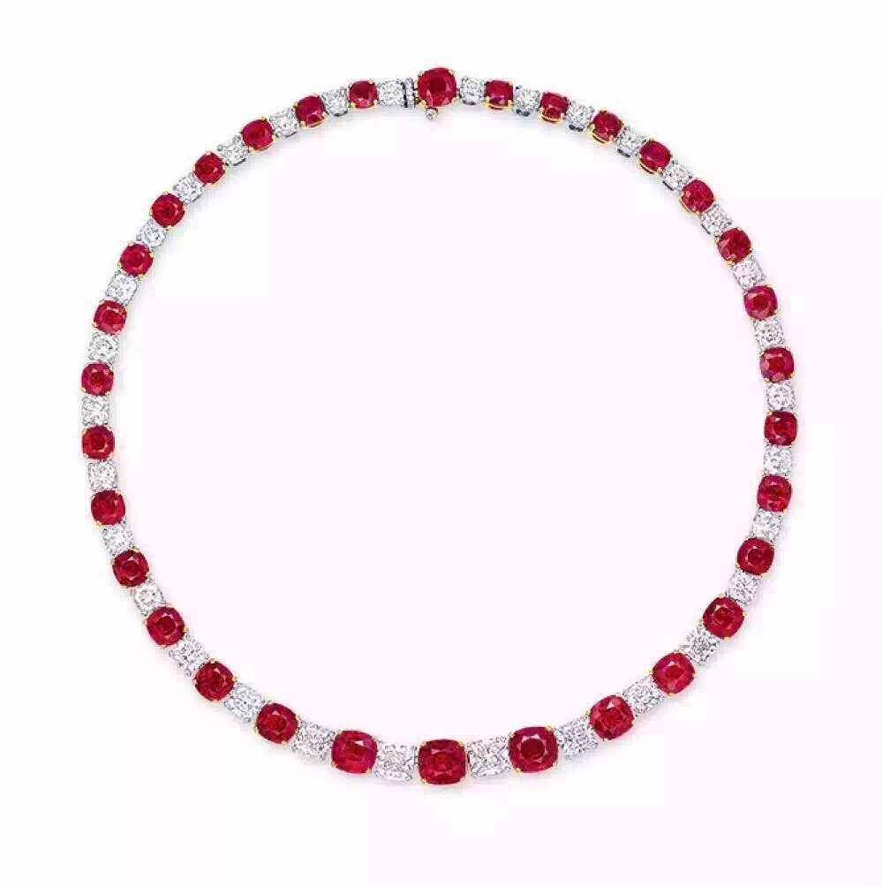
                    
Product 1

                

                

                    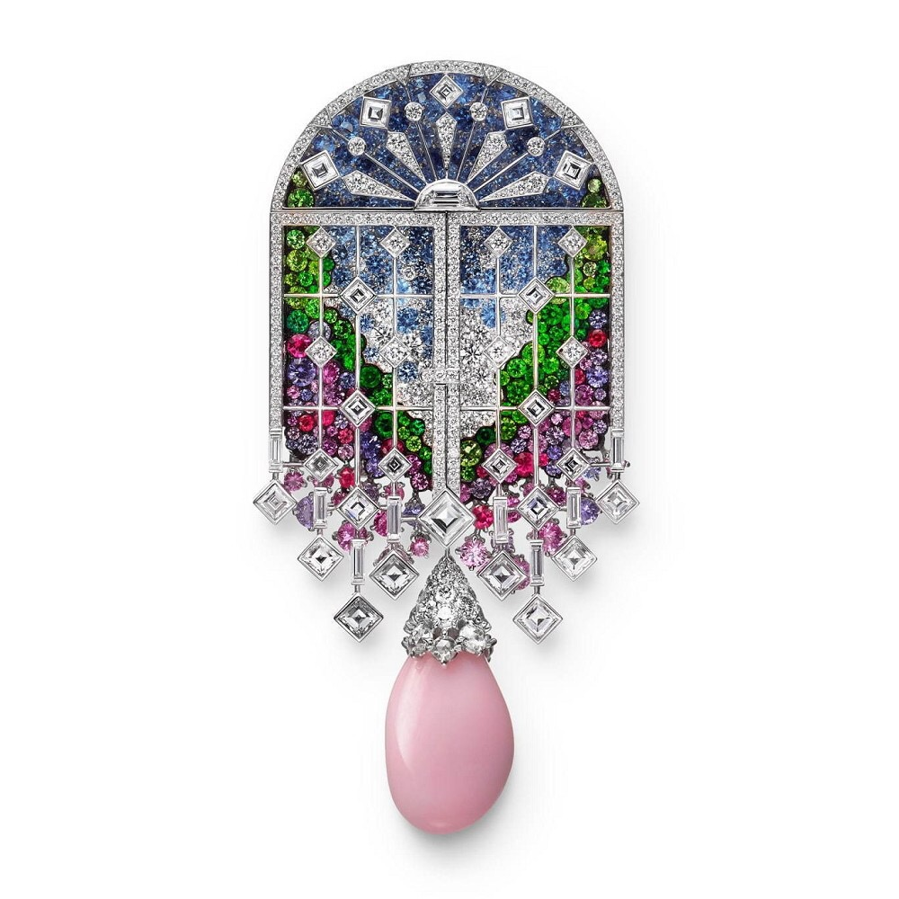
                    
Product 2

                

                

                    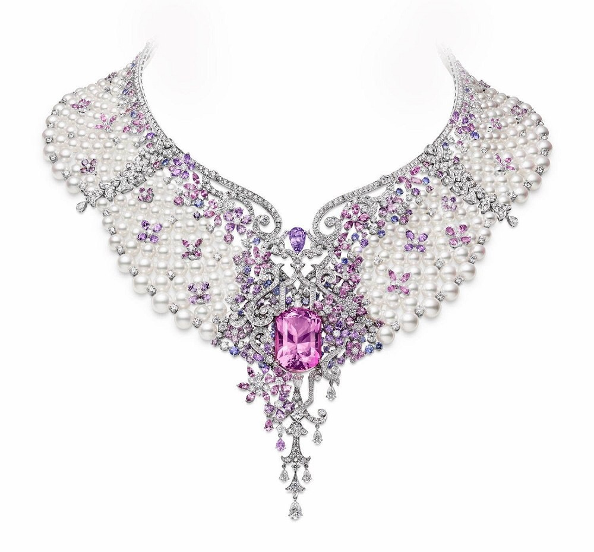
                    
Product 3

                

                

                    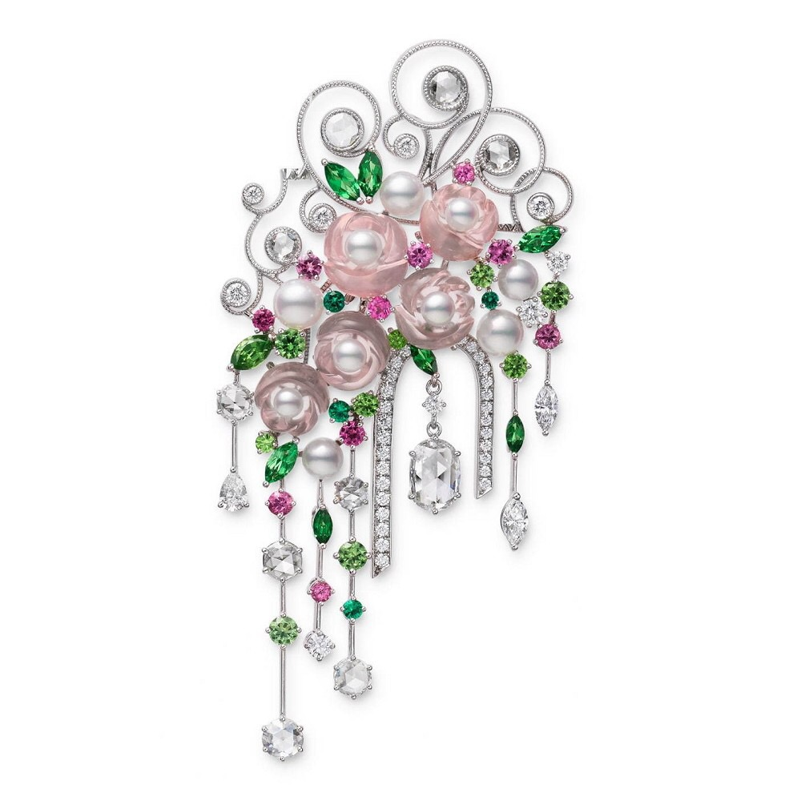
                    
Product 4

                

                

                    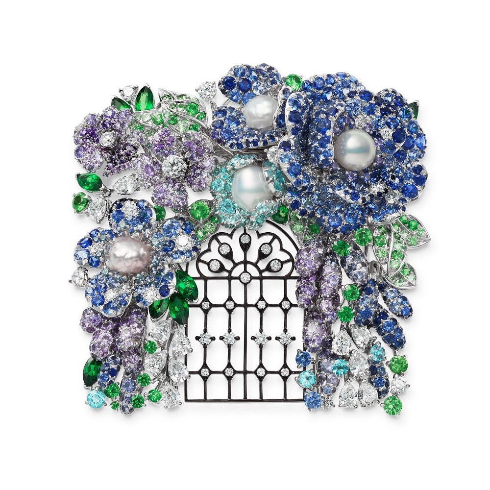
                    
Product 5

                

                

                    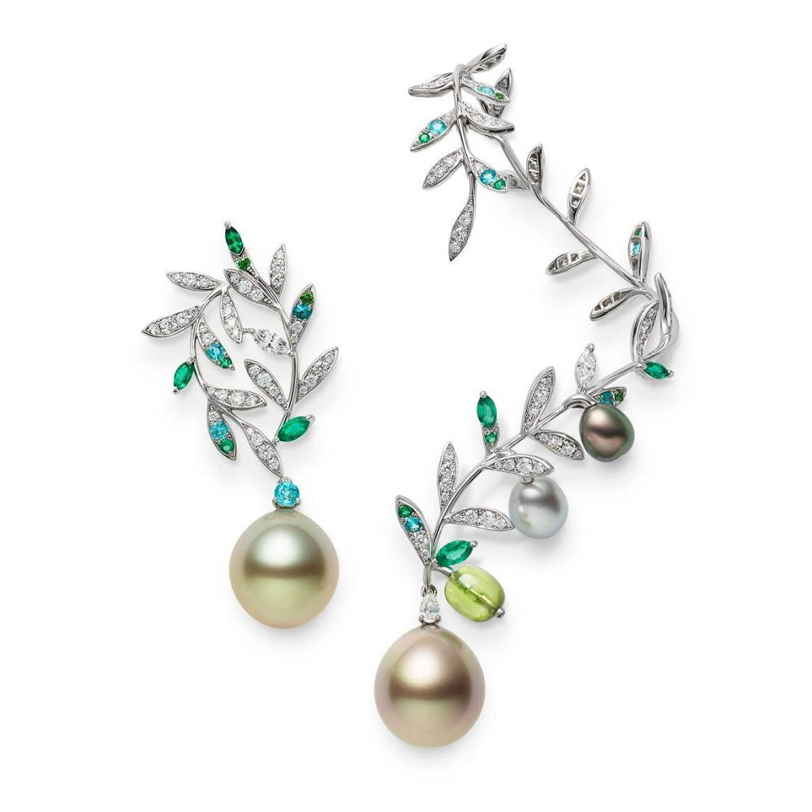
                    
Product 6

                

                

                    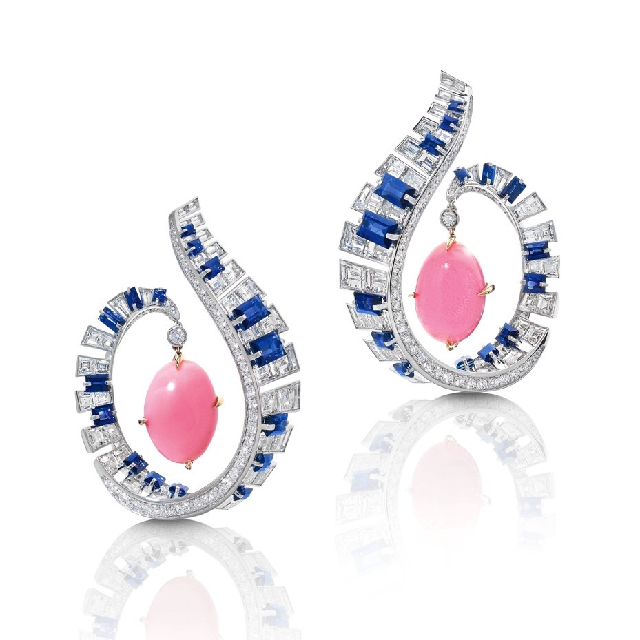
                    
Product 7

                

                

                    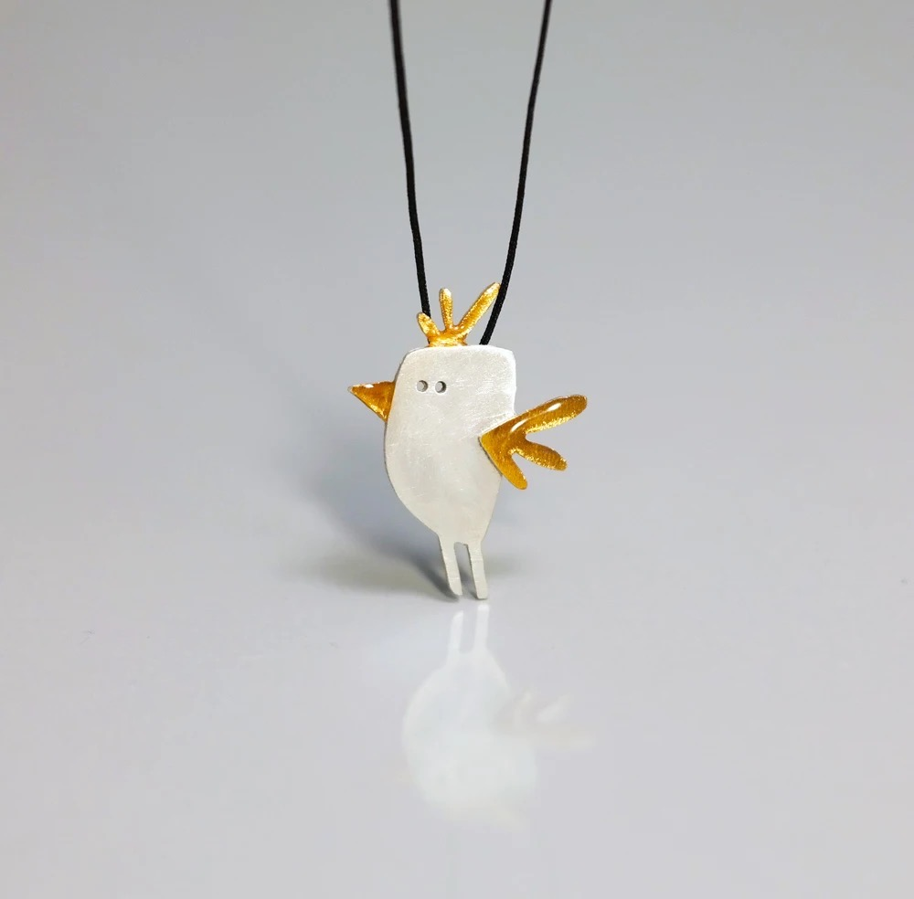
                    
Product 8

                

                

                    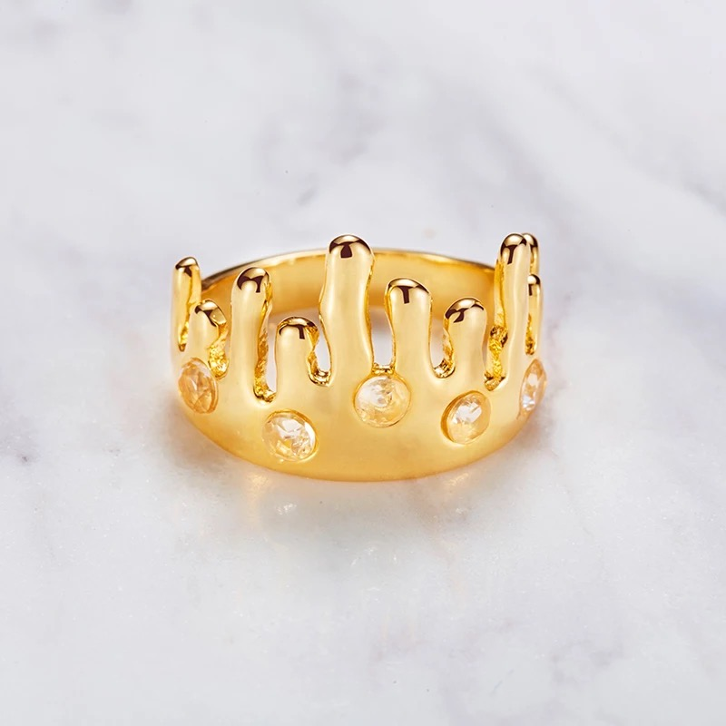
                    
Product 9

                

                

                    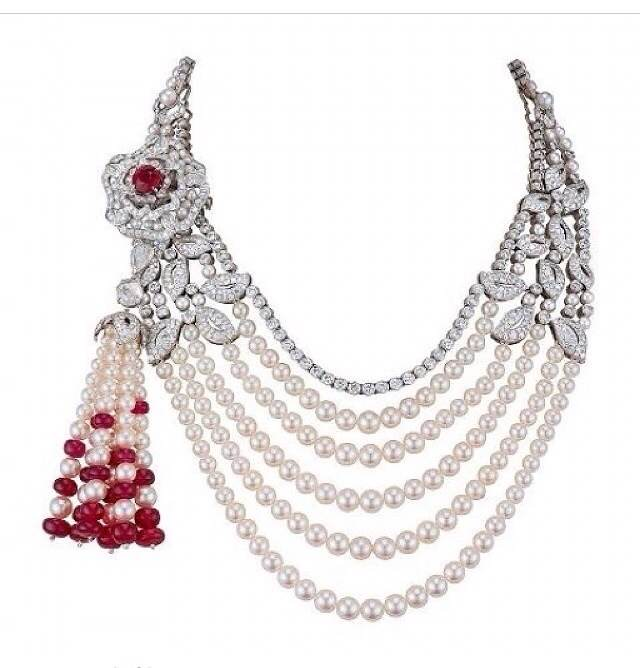
                    
Product 10

                

                

                    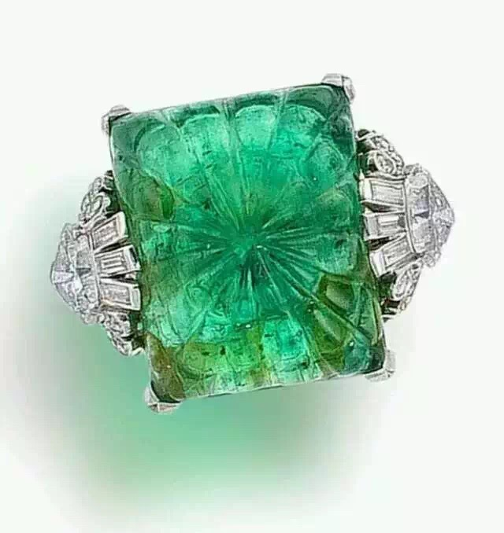
                    
Product 11

                

                

                    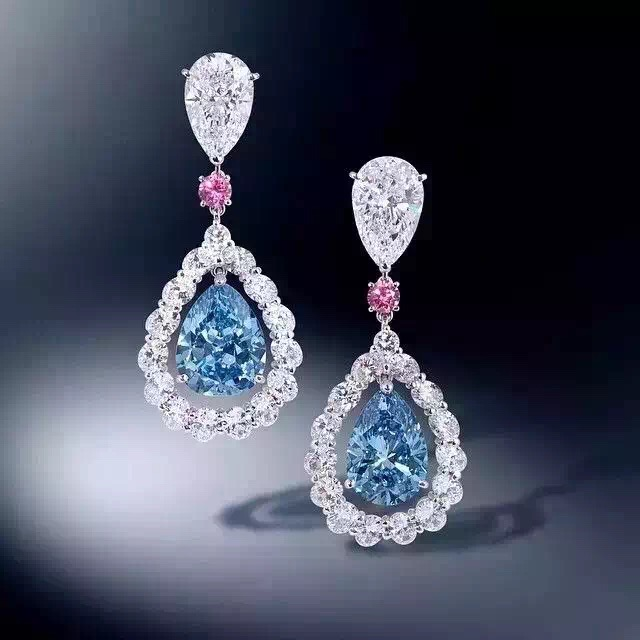
                    
Product 12

                

            

        </section>

        <section id="custom-design" class="container">
            <h2>Custom Design Services</h2>
            

                
At R'eclat, we offer custom design services to create personalized jewelry pieces tailored to your unique style and taste. Our experienced artisans use their craftsmanship and expertise to bring your vision to life by selecting the finest materials and using innovative design techniques.

                
To take advantage of our custom design services and receive a one-of-a-kind piece of jewelry, follow these simple steps:

                <ol>
                    <li>Contact us to schedule a consultation with our designers.</li>
                    <li>Share your vision, preferences, and budget during the consultation.</li>
                    <li>Our designers will create a design sketch and provide a price quote for your approval.</li>
                    <li>Upon approval, we will create your custom piece using the highest quality materials and craftsmanship.</li>
                </ol>
                
Start your journey to exceptional style by creating a unique piece of jewelry that reflects your personality and showcases your individuality. For more information or to schedule a consultation, please <a href="#contact">contact us</a>.

            

        </section>

        <section id="digital-presence" class="container">
            <h2>Digital Presence</h2>
            
Recognizing the importance of digital connectivity in today’s world, R’éclat provides an online platform...

        </section>

        <section id="contact" class="container">
            <h2>Contact Us</h2>
            
If you have any questions or concerns, please feel free to reach out by filling out the form below:

            

                <form class="contact-form" action="#" method="POST">
                    <input type="text" name="name" placeholder="Your name" required>
                    <input type="email" name="email" placeholder="Your email" required>
                    <textarea name="message" rows="6" cols="40" placeholder="Your message" required></textarea>
                    <input type="submit" value="Send Message">
                </form>
            

            
Alternatively, you can also email us at: <a href="mailto:info@reclat.co">info@reclat.co</a>

        </section>
    </main>

    <footer>
        <!-- 添加带图标的按钮组 -->
        

            <a href="https://www.facebook.com/" target="_blank"><i class="fab fa-facebook-f"></i></a>
            <a href="https://www.twitter.com/" target="_blank"><i class="fab fa-twitter"></i></a>
            <a href="https://www.instagram.com/" target="_blank"><i class="fab fa-instagram"></i></a>
        

        &copy; R'eclat, 2023. All Rights Reserved.
    </footer>
</body>
</html>